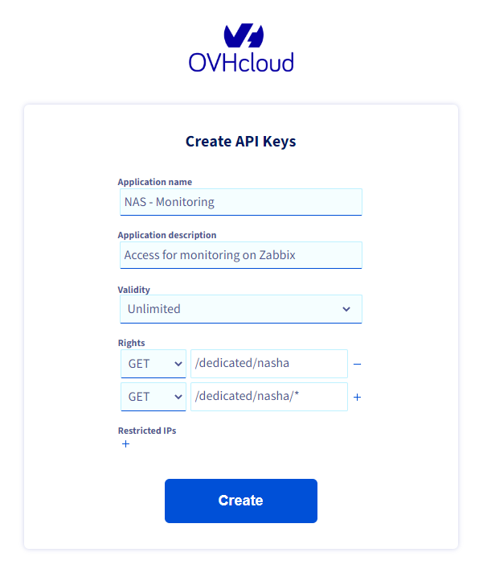
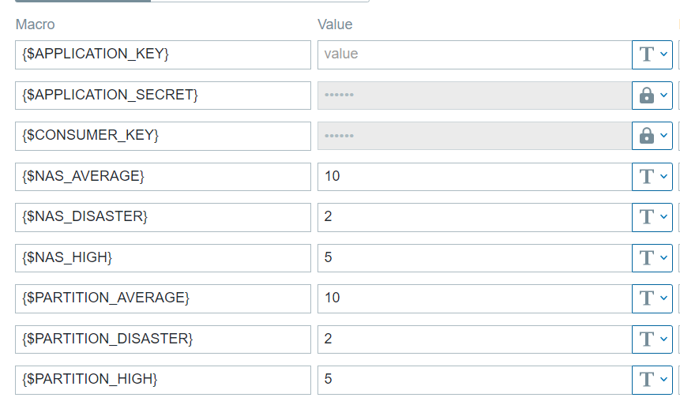

# NAS OVH

- Author : Florian DJERBI
- Object : Monitoring NAS OVH
- Creation Date : 03/16/2023
- Modification Date : 04/24/2023

## Information
- Version Python: 3.7+
- Version: 0.4
- Library: ovh, json, sys

## Installation
Importer le template **ovh-nas_templates.xml** sur votre Zabbix.

### OVH API Token
Il faut tout d'abord créer un Token pour les accès [OVH](https://www.ovh.com/auth/api/createToken).



Vous pouvez aussi restreindre les accès à l'IP du serveur de monitoring.

### Installation Serveur
``` bash
mkdir /etc/zabbix/scripts/ovh-nas
cd /etc/zabbix/scripts/ovh-nas
python3.7 -m venv env
source env/bin/activate
pip install ovh mysql-connector
env/bin/python3.7 nas.py # Test script
```
Copier/Coller les scripts python dans le dossier.

``` conf
#/etc/zabbix/zabbix_agentd.d/userparameter_nas.conf
UserParameter=OVHAPI.NAS[*],cd /etc/zabbix/scripts/ovh-nas && env/bin/python3.7 nas.py $1 $2 $3
UserParameter=OVHAPI.NAS.INFO[*],cd /etc/zabbix/scripts/ovh-nas && env/bin/python3.7 nas-info.py $1 $2 $3 $4
UserParameter=OVHAPI.PARTITION[*],cd /etc/zabbix/scripts/ovh-nas && env/bin/python3.7 partition.py $1 $2 $3
UserParameter=OVHAPI.PARTITION.INFO[*],cd /etc/zabbix/scripts/ovh-nas && env/bin/python3.7 partition-info.py $1 $2 $3 $4 $5
UserParameter=OVHAPI.INFO.SQL[*],cd /etc/zabbix/scripts/ovh-nas && env/bin/python3.7 all_info_sql.py $1 $2 $3 $4 $5 $6 $7
```
Changer le chemin si besoin.

### Template Zabbix
Importez-le [template sur zabbix](./ovh-nas_templates.xml). Puis ajouter le template sur le serveur de monitoring dans zabbix.

3 Macros sont a renseigner:
 - {$APPLICATION_KEY}
 - {$APPLICATION_SECRET}
 - {$CONSUMER_KEY}
 
Les valeurs de du Token d'accès OVH API.



**Bien penser à mettre en place des actions pour les différentes alertes *(Average, High et Disaster)*!**

### Database SQL
Importer la [table ovh-nas_info](./table_ovh-nas_info.sql) et [table ovh-partition_info](./table_ovh-partition_info.sql) sur votre database de votre choix.

4 Macros sont a renseigner:
 - {$SQL_HOST_DOMAIN}
 - {$SQL_USER_DOMAIN}
 - {$SQL_PASSWORD_DOMAIN}
 - {$SQL_DATABASE_DOMAIN}

 Un item fait la mise à jours des nas et partition tous les jours.
